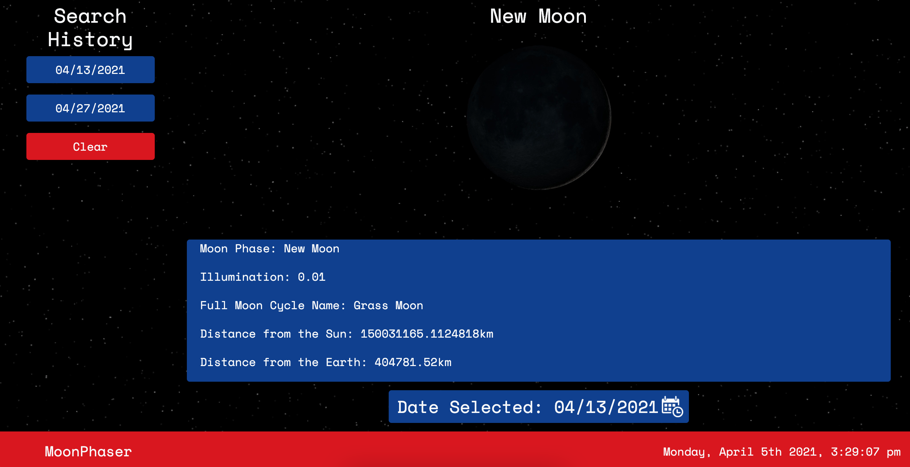

# MoonPhaser

## About

   MoonPhaser was a collaborative project intent on using moon phase data from an API as well as information from the many aviable NASA APIs to design a web application aimed at piquing interest in the constantly changing information from space. After finding the [farmsense API](https://www.farmsense.net/). This refined our User Story to designing a site that allowed a user to view moon phase informtion for any given day they might input- and to record recently searched dates in order to more easily compare similar dates across time, such as a birthday or anniversary. We decided to generate the NASA Astronomy picture of the Day from [its respective API](https://github.com/nasa/apod-api) upon page load as it was the most astronomy beginner friendly API of the many APIs NASA offers. We will also be having a NASA API incorporated into our page as well.
  
  The site may be accessed at: [its GitHub page url](https://anth8nyc.github.io/MoonPhases/)

##  Site Preview
